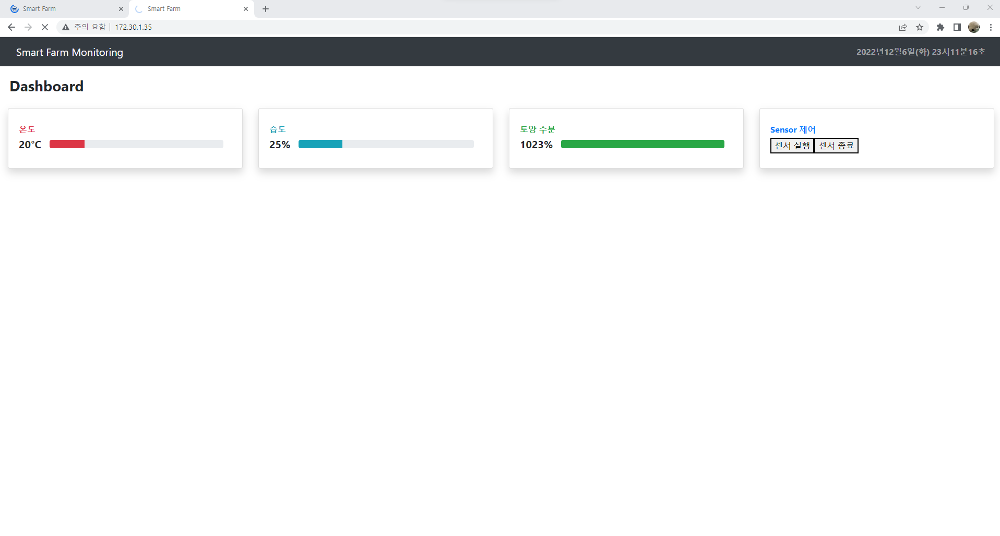
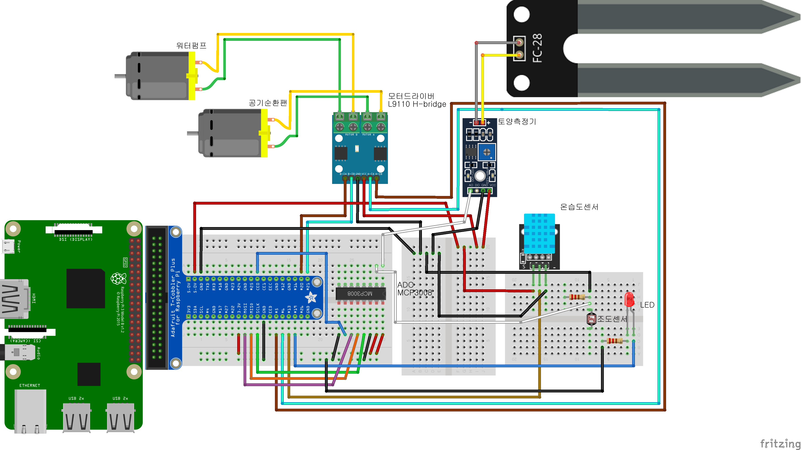
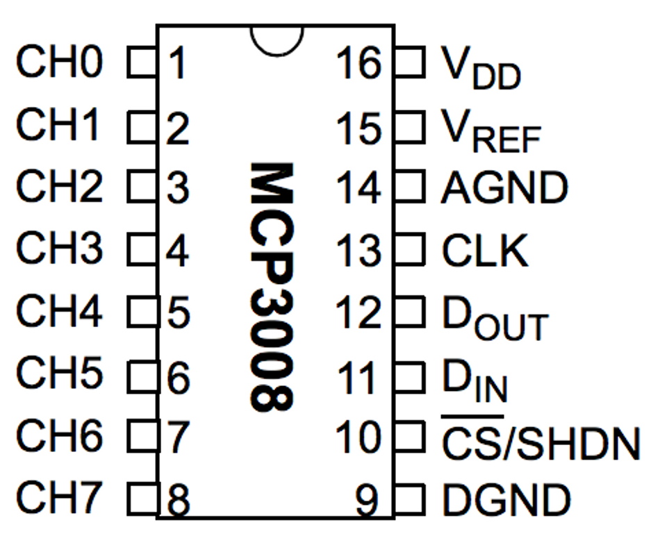
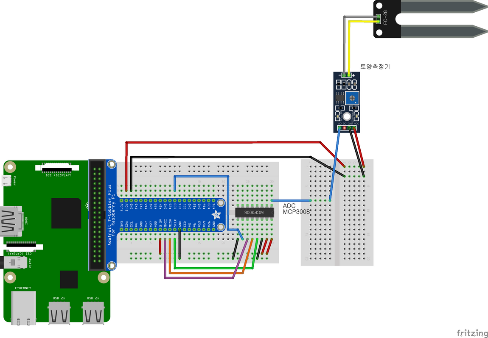

# smarFarm

스마트팜 프로젝트 Repo

# Install & setting

## Apache
```bash
$ apt-get install apache2
$ service apache2 start
$ sudo cp -r smartfarm/index.html /var/www/html
$ sudo cp -r smartfarm/css/ /var/www/html
$ sudo cp -r smartfarm/js/ /var/www/html
$ sudo cp -r smartfarm/icon/ /var/www/html
```

## Apache Setting
```bash
$ sudo vi /etc/apache2/conf-available/server-cgi-bin.conf
```

### 변경 전
```
ScriptAlias /cgi-bin/ /usr/lib/cgi-bin/
<Directory "/usr/lib/cgi-bin"> // 디폴트 CGI 홈 디렉터리
    AllowOverride None Options +ExecCGI -Multiviews +SymLinkslf
```

### 변경 후 (이렇게 변경 필요)
```
ScriptAlias /cgi-bin/ /var/www/html/cgi-bin/
<Directory "/var/www/html/cgi-bin/"> // 디폴트 CGI 홈 디렉터리
    AllowOverride None Options +ExecCGI -Multiviews +SymLinkslf
```

## Server
```bash
$ gcc -o test farm_server.c -lwiringPi -pthread
$ chmod 755 ./farm_server
$ sudo cp ws.cgi /var/www/html/cgi-bin
```

## Go Web Site
`http://<Server IP>:80`



# 회로도 및 부품

## 회로도
- LED, 조도센서 등 일부 부품 사용 안 함


## 부품 리스트
|No.|부품명|수량|용도|
|------|---|---|---|
|1|Raspberry Pi 4 Model B|1|임베디드 시스템 구축|
|2|온습도 센서(DTH11)|1|온습도 측정|
|3|공기 순환 팬|1|공기 순환|
|4|토양 수분 측정기|1|토양수분 측정|
|5|모터 드라이버|1|팬 동작|
|6|워터펌프|1|토양에 물 제공|
|7|ADC 컨버터|1|디지털 신호 변환|

## 부품 설명
### MCP3008

**ADC(Analog-to-Digital Converter)**

- 온습도센서의 아날로그 신호를 디지털신호 변환기
- 라즈베리파이와 데이터 송/수신시 SPI라는 통신방법을 사용

### SPI통신

**SPI(Serial Peripheral Interface)**

- SPI통신은 연결된 다른 기기들과 직렬방식으로 통신하는 통신 프로토콜
직렬통신이란 하나의 데이터선을 이용해서 한비트씩 순차적으로 데이터를 전송하는 통신으로 SPI는 이러한 직렬통신 방식중 하나임
- SPI통신은 하나의 데이터선을 이용하지 않고 송신선과 수신선 별도로 되어있어 다른 시리얼 통신에 비해 통신속도가 빠름
- SPI 통신을 위해서는 최소 4개 이상의 통신선이 필요함
    - MOSI (Master Out, Slave In) : 마스터에서 슬레이브로 데이터 전송
    - MISO (Master In, Slave Out) : 슬레이브에서 마스터로 데이터 전송
    - SCK (Serial Clock) : 마스터에서 슬레이브로 클락 전송
    - SS (Slave Select) : 데이터를 송수신할 슬레이브 선택 → 마스터가 지정


| 기본적인 SPI통신 방식



| MCP3008 핀 기능


**MCP3008 핀 기능 설명**

- Pin 1 ~ 8 - ADC 채널 0 ~ 7 (Analog Input)
- Pin 9 - digital ground (DGND)
    - 내부 디지털 회로에서 디지털 접지 연결
- Pin 10 - Chip Select/Shutdown Input (CS/SHDN)
    - 칩 선택또는 Shutdown
- Pin 11 - Serial Data Input (DIN)
    - 데이터 입력 핀 : 라즈베리파이에서 채널번호 전송
- Pin 12 - Serial Data Output (DOUT)
    - 데이터 출력 핀 : A/D 변환 결과 반환
- Pin 13 - Serial Clock (CLK)
    - 클럭 발생시 동작
- Pin 14 - analog ground (AGND)
    - 내부 아날로그 회로에서 접지 연결
- Pin 15 - Reference Voltage Input (RFF)
    - 래퍼런스 전압 압력
- Pin 16 - +2.7V to 5.5V Power Supply (VDD)
   - 칩 동작 전원



| MCP3008 연결도

|Raspberry Pi|MCP 3008|
|------|---|
|SCLK|CLK|
|MOSI|DIN|
|MISO|DOUT|
|CE 0|CS/SHDN|
|5V, 3.3V|VDD, VREF|
|GND|DGND, AGND|


### 참조
[https://www.microchip.com/en-us/product/MCP3008](https://www.microchip.com/en-us/product/MCP3008)

[https://en.wikipedia.org/wiki/Serial_Peripheral_Interface](https://en.wikipedia.org/wiki/Serial_Peripheral_Interface)

### L9110S 모터드라이버

**개요**

입력전압 : DC 2.5V ~ 12V

출력전류 : 800mA

제어모터 수 : 2채널 ,2.5V ~ 12V 까지 작동

pin 신호를 1,0 주면 작동 1,1 주면 정지


L9110S 핀 정보

1. B-IA: Motor B Input A
2. B-IB: Motor B Input B
3. GND: ground
4. VCC: 2.5V-12V DC
5. A-IA: Motor A Input A
6. A-IB: Motor B Input B
