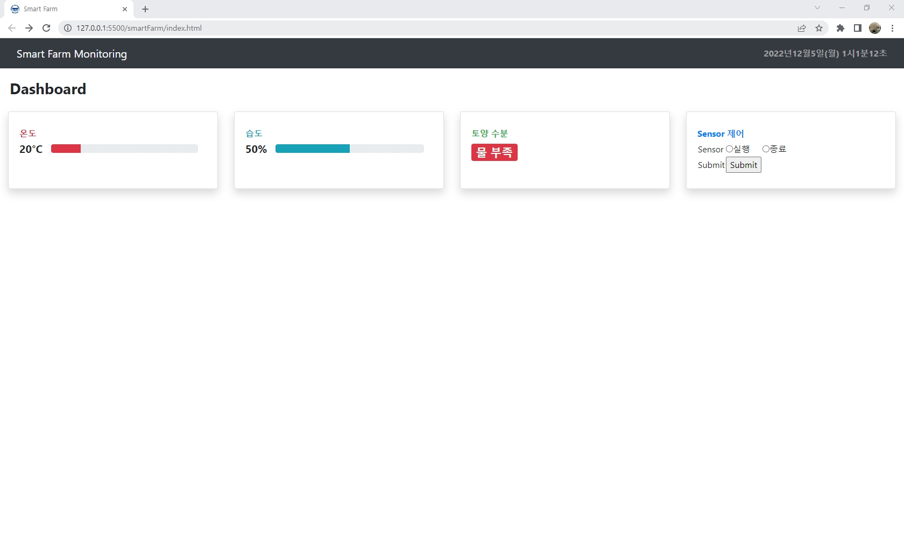

# smarFarm

스마트팜 프로젝트 Repo

# Install & setting

## Apache
```bash
$ apt-get install apache2
$ service apache2 start
$ sudo cp -r smartfarm/index.html /var/www/html
$ sudo cp -r smartfarm/css/ /var/www/html
$ sudo cp -r smartfarm/js/ /var/www/html
$ sudo cp -r smartfarm/icon/ /var/www/html
```

## Apache Setting
```bash
$ sudo vi /etc/apache2/conf-available/server-cgi-bin.conf
```

### 변경 전
```
ScriptAlias /cgi-bin/ /usr/lib/cgi-bin/
<Directory "/usr/lib/cgi-bin"> // 디폴트 CGI 홈 디렉터리
    AllowOverride None Options +ExecCGI -Multiviews +SymLinkslf
```

### 변경 후 (이렇게 변경 필요)
```
ScriptAlias /cgi-bin/ /var/www/html/cgi-bin/
<Directory "/var/www/html/cgi-bin/"> // 디폴트 CGI 홈 디렉터리
    AllowOverride None Options +ExecCGI -Multiviews +SymLinkslf
```

## Server
```bash
$ g++ -o ws.cgi farm_server.c -lwiringPi
$ sudo cp ws.cgi /var/www/html/cgi-bin
```

## Go Web Site
`http://<Server IP>:80`

